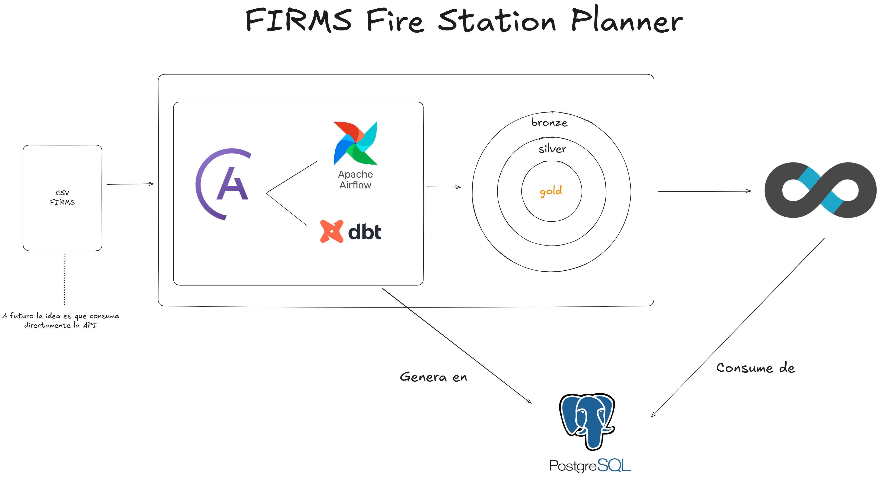
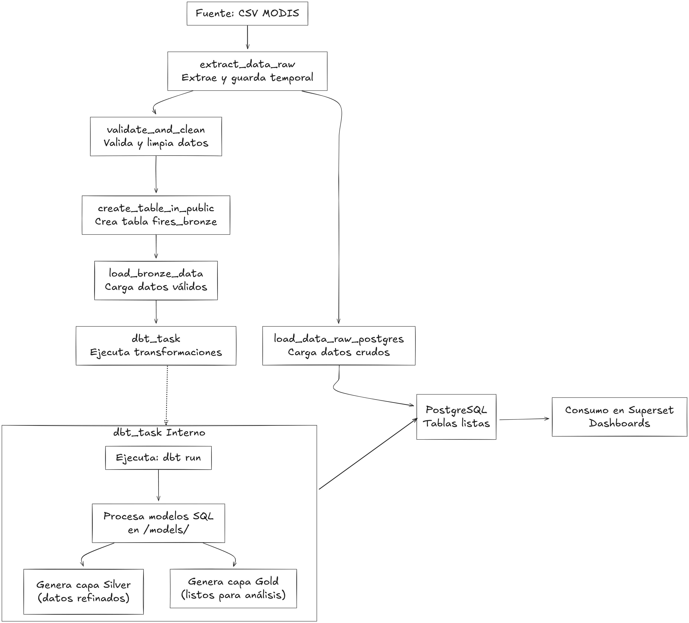

# Proyecto ETL (Firms) Fire Station Pllaner

## Descripción General

Este proyecto es un pipeline de Data Engineering enfocado en el procesamiento y análisis de datos de incendios forestales obtenidos del satélite MODIS (Moderate Resolution Imaging Spectroradiometer). Utiliza Apache Airflow para orquestar un flujo ETL (Extract, Transform, Load) que extrae datos de un archivo CSV, los valida y limpia, los carga en una base de datos PostgreSQL (capa Bronze), y luego aplica transformaciones con DBT para generar capas Silver y Gold.

El objetivo es crear un sistema escalable para el monitoreo de incendios, con validación de calidad de datos y preparación para análisis posteriores. Incluye integración con herramientas como Pandas para manipulación de datos y SQLAlchemy para interacciones con la base de datos.

### Arquitectura del Flujo ETL

El pipeline sigue un enfoque de capas de datos (Bronze, Silver, Gold) para estructurar el procesamiento. A continuación, un diagrama en ASCII art que representa el flujo principal (basado en el DAG `add_modis_data.py` y los modelos DBT):

```
+-------------------+
|   Fuente de Datos |
|   (CSV: MODIS/   |
|    FIRMS)         |
+-------------------+
         |
         v
+-------------------+
|   Extract         |
|   (Pandas:        |
|    pd.read_csv)   |
+-------------------+
         |
         v
+-------------------+
|   Transform       |
|   (Pandas/NumPy:   |
|    validate_and_clean)|
+-------------------+
         |
         v
+-------------------+
|   Load            |
|   (SQLAlchemy +   |
|    PostgreSQL:    |
|    fires_bronze)  |
+-------------------+
         |
         v
+-------------------+
|   Transform       |
|   (DBT: modelos   |
|    SQL en /models/)|
+-------------------+
         |
         v
+-------------------+
|   Orquestación    |
|   (Apache Airflow:|
|    DAG completo)  |
+-------------------+
         |
         v
+-------------------+
|   Consumo Final   |
|   (PostgreSQL:    |
|    Capas Gold)    |
+-------------------+
```

**Notas del Diagrama**:
- **Fuente**: Archivo CSV en `include/raw/modis-fire-two-months.csv` (datos FIRMS/MODIS).
- **Extracción y Transformación**: Usando Python con Pandas para leer, validar (e.g., filtrar por `frp > 0` y `confidence > 30`) y limpiar datos.
- **Carga**: SQLAlchemy crea y carga en tabla `fires_bronze` en PostgreSQL.
- **Transformaciones Avanzadas**: DBT ejecuta modelos SQL (e.g., en `dags/dbt/fire_dbt/models/`) para generar capas Silver (datos refinados) y Gold (listos para análisis).
- **Orquestación**: Apache Airflow maneja el DAG con tasks como `extract_data_raw`, `validate_and_clean`, y `load_bronze_data`.
- **Futuro**: Idea de consumir directamente la API de FIRMS para datos en tiempo real, representado por el flujo continuo en el diagrama.

## Contenido del Proyecto
Este proyecto de Astronomer incluye los siguientes archivos y carpetas clave:
Formato del proyecto:

Como funciona el DAG?


- **dags/**: Contiene los archivos Python para los DAGs de Airflow.
  - `add_modis_data.py`: DAG principal que implementa el pipeline ETL completo, incluyendo extracción, validación, carga en Bronze y ejecución de DBT.
- **dags/dbt/fire_dbt/**: Proyecto DBT para transformaciones.
  - `models/`: Contiene modelos SQL (e.g., `fires_raw.sql`, `silver/`, `gold/`) para generar capas refinadas.
  - `dbt_project.yml` y `profiles.yml`: Configuración de DBT.
- **include/**: Archivos adicionales, como `raw/modis-fire-two-months.csv` (fuente de datos).
- **requirements.txt**: Dependencias Python (e.g., pandas, sqlalchemy, psycopg2).
- **Dockerfile**: Imagen de Astro Runtime para ejecutar Airflow.
- **airflow_settings.yaml**: Configuraciones locales para conexiones (e.g., PostgreSQL).

## Herramientas Utilizadas

- **Apache Airflow**: Orquestación de workflows y DAGs.
- **DBT (Data Build Tool)**: Transformaciones SQL para capas de datos.
- **PostgreSQL**: Base de datos para almacenamiento estructurado.
- **Python con Pandas y NumPy**: Manipulación y validación de datos.
- **SQLAlchemy**: Interacción con la base de datos.
- **Docker/Astronomer CLI**: Para ejecución local y despliegue.

## Despliegue Local

### Prerrequisitos
- Instala Docker y el Astronomer CLI (`astro`).
- Asegúrate de tener puertos 8080 (Airflow UI) y 5432 (PostgreSQL) disponibles.

### Pasos para Ejecutar
1. Inicia Airflow localmente:
   ```
   astro dev start
   ```
   Esto levanta cinco contenedores Docker:
   - Postgres: Base de datos de metadatos de Airflow.
   - Scheduler: Monitorea y activa tasks.
   - DAG Processor: Parsea los DAGs.
   - API Server: Sirve la UI de Airflow y API.
   - Triggerer: Para tasks diferidas.

2. Accede a la UI de Airflow en `http://localhost:8080/`. También puedes conectar a PostgreSQL en `localhost:5432/postgres` (usuario: `postgres`, contraseña: `postgres`).

3. Ejecuta el DAG:
   - En la UI de Airflow, activa el DAG `complete_etl_pipeline` (de `add_modis_data.py`).
   - Monitorea los logs para ver el procesamiento: extracción, validación, carga y ejecución de DBT.

### Notas
- Si los puertos están ocupados, detén contenedores existentes o cambia los puertos (ver [troubleshooting de Astronomer](https://www.astronomer.io/docs/astro/cli/troubleshoot-locally#ports-are-not-available-for-my-local-airflow-webserver)).
- Para debugging, revisa los logs en los contenedores con `astro dev logs`.

## Despliegue en Astronomer

Si tienes una cuenta en Astronomer, puedes desplegar el proyecto fácilmente. Consulta la documentación oficial: [Deploy Code to Astronomer](https://www.astronomer.io/docs/astro/deploy-code/).

## Contribuciones y Soporte

- Este proyecto está diseñado para ser escalable; considera agregar más fuentes de datos (e.g., API de FIRMS) o validaciones adicionales.
- Para reportar bugs o sugerencias, contacta al equipo de Astronomer o abre un issue en el repositorio.

---
